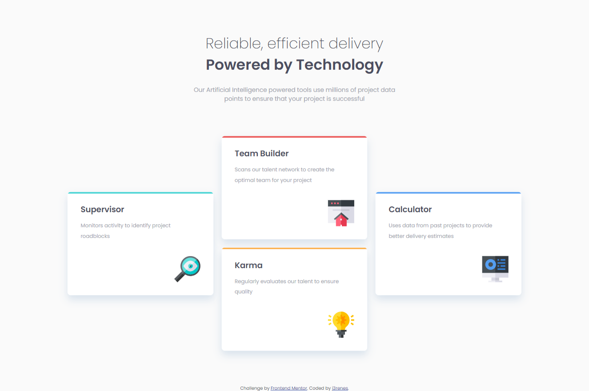

# Frontend Mentor - Four card feature section solution

This is a solution to the [Four card feature section challenge on Frontend Mentor](https://www.frontendmentor.io/challenges/four-card-feature-section-weK1eFYK). Frontend Mentor challenges help you improve your coding skills by building realistic projects. 

## Table of contents

- [Overview](#overview)
  - [The challenge](#the-challenge)
  - [Screenshot](#screenshot)
  - [Links](#links)
- [My process](#my-process)
  - [Built with](#built-with)
  - [What I learned](#what-i-learned)
  - [Continued development](#continued-development)
  - [Useful resources](#useful-resources)
- [Author](#author)
- [Acknowledgments](#acknowledgments)

**Note: Delete this note and update the table of contents based on what sections you keep.**

## Overview

### The challenge

Users should be able to:

- View the optimal layout for the site depending on their device's screen size

### Screenshot

### Links

- Solution URL: [https://github.com/t13cedesign/Frontend-Mentor---Four-card-feature-section-solution]
- Live Site URL: [https://t13cedesign.github.io/Frontend-Mentor---Four-card-feature-section-solution/]

## My process

### Built with

- Semantic HTML5 markup
- CSS custom properties
- Flexbox
- CSS Grid
- Mobile-first workflow

### Useful resources

- [Normalize.css](https://necolas.github.io/normalize.css/) - A modern, HTML5-ready alternative to CSS resets
  Normalize.css makes browsers render all elements more consistently and in line with modern standards. It precisely targets only the styles that need normalizing.

### What I learned

Working with a simple and effective code, as it's possible?

## Author

- Website - [j3renes](https://juanantoniobrenes.myportfolio.com/projects)
- Frontend Mentor - [@t13cedesign](https://www.frontendmentor.io/profile/t13cedesign)